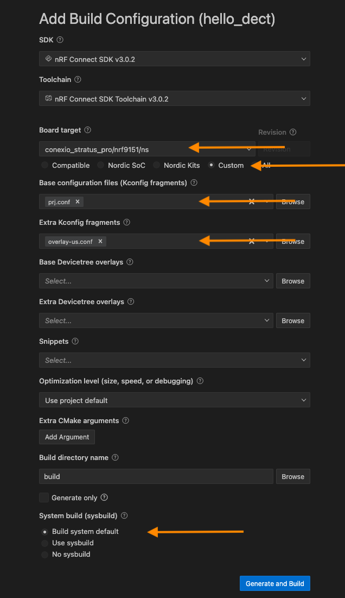

# Getting started with DECT NR+ on nRF9151/61 Conexio Stratus Pro 

## nRF91x1: DECT NR+ PHY hello

The DECT NR+ physical layer (PHY) hello sample demonstrates how to set up a simple DECT NR+ application with the DECT PHY firmware running on nRF9151/nRF9161 Conexio Stratus Pro devices.

> [!NOTE]
> The sample only showcases the use of the `nrf_modem_dect_phy` interface of the Modem library and is not a complete standalone application.

## Requirements

The sample supports the Conexio Stratus Pro development kits, and requires at least two kits to run the demo program

* nRF Connect SDK version 3.0.2 installed
* Conexio Stratus SDK or board files installed
* DECT PHY firmware version 1.1.0 and newer (mfw-nr+_nrf91x1_1.1.0.zip)

Refer to [Conexio Documentation](https://docs.conexiotech.com/master/building-and-programming-an-application/fetch-conexio-firmware-sdk-and-board-definition-files) on how to fetch the board files and to complete the above steps.

> [!NOTE]
> The `nrf_modem_dect_phy_hello` sample requires the **DECT NR+ PHY firmware** to run on the nRF91x1 modem core.
> For more information, contact the Nordic Semiconductor sales department.


## Overview

The sample shows a simple broadcast and reception of DECT NR+ messages between devices on a hard-coded channel.

After initialization, the devices run into a loop, transmitting a counter value before listening for incoming receptions.
The time to listen is set by the `CONFIG_RX_PERIOD_S <CONFIG_RX_PERIOD_S>` Kconfig option.
The loop is exited after a number of transmissions set by the `CONFIG_TX_TRANSMISSIONS <CONFIG_TX_TRANSMISSIONS>` Kconfig option, or it continues forever if the `CONFIG_TX_TRANSMISSIONS <CONFIG_TX_TRANSMISSIONS>` Kconfig option is set to ``0``.

Each device can be reset to run the sample again.

## Build Configuration for using nRF Connect Extension


Prior to compiling the **hello_dect** application, we first need to generate the device build configuration for the project by clicking on the **Add Build Configuration** option.

This opens a new tab, asking the user to select the board for which the build configurations will be generated. In our case, we will 

1) Check the **Custom** under the **Board target** option.
2) Then from the drop-down menu select the **Board target** as:
```
conexio_stratus_pro/nrf9151/ns
```

> [!NOTE]
> Make sure you have set the `board_root` correctly for the nRF Connect for VS Code as described in the [documentation](https://docs.conexiotech.com/master/building-and-programming-an-application/compiling-applications-with-nrf-connect-extension-for-vs-code#id-2.-point-the-build-system-to-the-custom-board-root-directory-of-conexio-boards) for your NCS version.


3) Under **Extra Kconfig fragments** options, browse and select `overlay-us.conf`.
4) To generate the correct binary/image, select **Use sysbuild** under **System build (sysbuild)** option.
5) Cick **Build Configuration** to start the Zephyr application build process.

> [!NOTE]
> Also make sure that you have patched the MCUBoot configuration files for Stratus Pro devices [outline here](https://docs.conexiotech.com/master/building-and-programming-an-application/fetch-conexio-firmware-sdk-and-board-definition-files#id-2-patch-mcuboot-file-for-stratus-pro-devices). 
> In addition, please delete the `conexio_stratus_pro.conf` file from the `ncs/v3.0.2/bootloader/mcuboot/boot/zephyr/boards`. This file is outdated now.




##  Flashing and Running the Sample Application on the Device

### Setting DFU Mode (Device Firmware Upgrade)

To program the device via USB, you will need to put the device into DFU (Device Firmware Upgrade) mode first. This mode triggers the onboard bootloader that accepts firmware binary files. To enter DFU mode:

1) Hold down Mode button : **BUTTON**
2) Press and release Reset button : **RESET**
3) Release only the RESET button, while holding down the MODE button
4) Wait for the white LED to turn on (steady-state)
5) Release the MODE button
6) The device is now in DFU mode. 🚨

### Flashing an application via USB using `newtmgr`

To upload the firmware, `zephyr.signed.bin`, we now have to:

* Open the terminal within the nRF Connect extension and invoke the 
```
newtmgr -c serial image upload build/hello_dect/zephyr/zephyr.signed.bin
```
making sure the device remains in DFU mode.

## Other Configuration options

Check and configure the following Kconfig options:


.. _CONFIG_CARRIER:

  The sample configuration defines the carrier to use.
  The availability of the channels and the exact regulations for using them vary in different countries.
  See section 5.4.2 of `ETSI TS 103 636-2`_ for the calculation.

.. _CONFIG_NETWORK_ID:

CONFIG_NETWORK_ID
   The configuration option specifies the network ID.
   It ranges from ``1`` to ``4294967295`` with the default value set to ``91``.

.. _CONFIG_MCS:

CONFIG_MCS
   The configuration option specifies the :term:`Modulation Coding Scheme (MCS)`.
   The MCS impacts how much data can fit into each subslot.
   The default value is set to ``1``.

.. _CONFIG_TX_POWER:

CONFIG_TX_POWER
   The configuration option sets the transmission power.
   See the table 6.2.1-3 of `ETSI TS 103 636-4`_ for more details.
   It ranges from ``0`` to ``11`` with the default value set to ``11``.

.. _CONFIG_TX_TRANSMISSIONS:

CONFIG_TX_TRANSMISSIONS
   The configuration option sets the number of transmissions before the sample exits.
   It ranges from ``0`` to ``4294967295`` with the default value set to ``30``.

.. _CONFIG_RX_PERIOD_S:

CONFIG_RX_PERIOD_S
   The sample configuration sets the receive window period.
   The time is set in seconds.
   The default value is set to 5 seconds.

Building and running
********************

.. important::
> [!NOTE]
   DECT NR+ operates on free but regulated radio channels.
   The regulations and availability of the channels vary by country and region.
   It is your responsibility to operate the devices according to local regulations, both at the development site and in the device operating regions.
   If you are in the EU or US with permission to operate on the DECT band and can ensure that access rules are met, you can use the ``overlay-eu.conf`` and ``overlay-us.conf`` Kconfig overlays, respectively.
   If other configuration is required, set the carrier using the `CONFIG_CARRIER <CONFIG_CARRIER>` Kconfig option, and the transmission power using the :ref:`CONFIG_TX_POWER <CONFIG_TX_POWER>` Kconfig option.
   If you, as a user, are not permitted to operate on the DECT band or cannot ensure that access rules are met, you must ensure there are no radio emissions from the devices running the sample.
   This can be done with the use of an RF chamber.

Testing
=======

1) Connect the kits
2) Fire up the serial terminal in the nRF Connect plugin
3) Observe that the devices transmit a counter value that is received by the other devices.
4) After a given number of transmissions, observe that the devices shut down and exit the sample.

Sample output
=============

The sample shows an output similar to the following:

Device 1:

```
All pins have been configured as non-secure
Booting TF-M v2.1.1-ncs4-2
[Sec Thread] Secure image initializing!
[00:00:00.256,591] <inf> lis2dh: fs=2, odr=0x4 lp_en=0x0 scale=9576
*** Booting nRF Connect SDK v3.0.2-89ba1294ac9b ***
*** Using Zephyr OS v4.0.99-f791c49f492c ***
[00:00:00.378,784] <inf> app: Dect NR+ PHY Hello sample started
[00:00:00.691,375] <inf> app: Dect NR+ PHY initialized, device ID: 12345
[00:00:00.691,406] <inf> app: Transmitting 0
[00:00:05.697,784] <inf> app: Transmitting 1
[00:00:10.704,193] <inf> app: Transmitting 2
[00:00:14.186,553] <inf> app: Received header from device ID 67890
[00:00:14.186,889] <inf> app: Received data (RSSI: -54.5): Hello DECT! 0
[00:00:15.710,571] <inf> app: Transmitting 3
[00:00:19.192,932] <inf> app: Received header from device ID 67890
[00:00:19.193,267] <inf> app: Received data (RSSI: -54.5): Hello DECT! 1
[00:00:20.716,949] <inf> app: Transmitting 4
...
[00:02:24.352,661] <inf> app: Received header from device ID 67890
[00:02:24.352,996] <inf> app: Received data (RSSI: -54.5): Hello DECT! 26
[00:02:25.876,739] <inf> app: Transmitting 29
[00:02:25.876,831] <inf> app: Reached maximum number of transmissions (30)
[00:02:25.876,831] <inf> app: Shutting down
[00:02:25.893,554] <inf> app: Bye!
```

Device 2:

```
All pins have been configured as non-secure
Booting TF-M v2.1.1-ncs4-2
[Sec Thread] Secure image initializing!
[00:00:00.256,591] <inf> lis2dh: fs=2, odr=0x4 lp_en=0x0 scale=9576
*** Booting nRF Connect SDK v3.0.2-89ba1294ac9b ***
*** Using Zephyr OS v4.0.99-f791c49f492c ***
[00:00:00.407,287] <inf> app: Dect NR+ PHY Hello sample started
[00:00:00.719,238] <inf> app: Dect NR+ PHY initialized, device ID: 67890
[00:00:00.719,268] <inf> app: Transmitting 0
[00:00:02.254,211] <inf> app: Received header from device ID 12345
[00:00:02.254,547] <inf> app: Received data (RSSI: -54.5): Hello DECT! 3
[00:00:05.725,646] <inf> app: Transmitting 1
[00:00:07.260,620] <inf> app: Received header from device ID 12345
[00:00:07.260,955] <inf> app: Received data (RSSI: -54.5): Hello DECT! 4
...
[00:02:10.885,284] <inf> app: Transmitting 26
[00:02:12.420,318] <inf> app: Received header from device ID 12345
[00:02:12.420,654] <inf> app: Received data (RSSI: -54.5): Hello DECT! 29
[00:02:15.891,693] <inf> app: Transmitting 27
[00:02:20.898,071] <inf> app: Transmitting 28
[00:02:25.904,449] <inf> app: Transmitting 29
[00:02:25.904,541] <inf> app: Reached maximum number of transmissions (30)
[00:02:25.904,571] <inf> app: Shutting down
[00:02:25.921,325] <inf> app: Bye!
```

## Credit

Nordic Semiconductor

